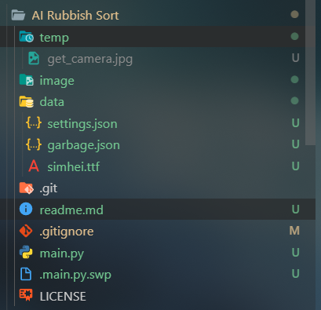
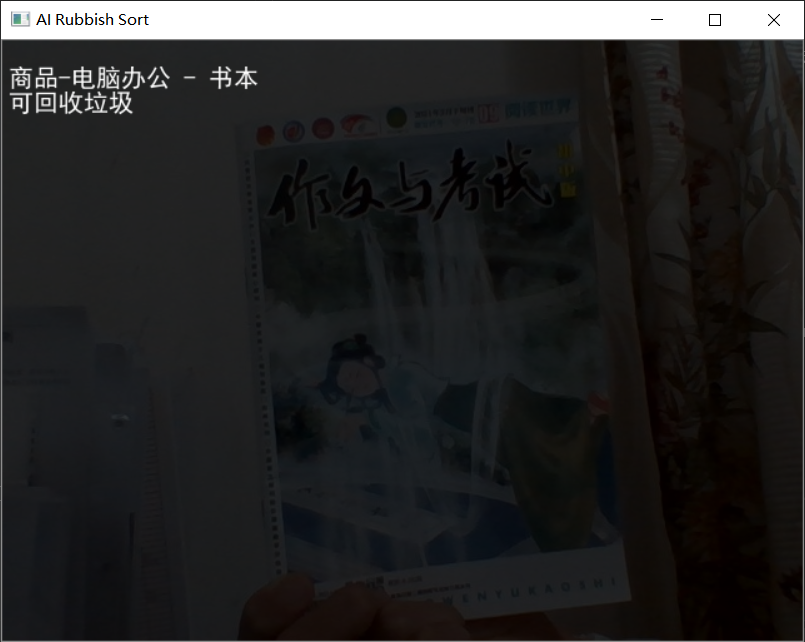

<h1 align="center">
  AI 助力垃圾分类
</h1>
<p align="center">
  AI Rubbish Sort
</p>

---

## 信息

- 作者 上虞外国语学校 八(六)班 方宇祺
- 开源许可证 GPL v3
- 源代码仓库 [Gitee](https://gitee.com/TimFangDev/ARS)/[GitHub](https://github.com/Tim-Fang/AI-Rubbish-Sort)

---

## 说明

开展生活垃圾分类,推行垃圾减量化,资源化,无害化,是对传统生产生活方式的一场变革,是一项长期,复杂的系统工程.  
为了使人们更方便地垃圾分类,特制作此工具 识别摄像头图像并给出其垃圾种类

---

## 安装

### 环境

- 系统
  - Windows XP 及以上  
  - Linux 和 MacOS 暂未测试

- 软件环境

  - Python 3.8.x  
    _推荐 3.8 版本 某些包可能不支持更新的版本_

  - Python 包

    - Numpy
    - OpenCV
    - Pillow
    - Requests
    - BaiduAip

    ```bash
    pip config set global.index-url https://pypi.tuna.tsinghua.edu.cn/simple
    pip install numpy
    pip install opencv-python
    pip install pillow
    pip install requests
    pip install baidu-aip
    ```

---

## 使用

为了保证分类信息能及时更新  
在第一次使用前需要更新程序  
您可以在[Gitee](https://gitee.com/TimFangDev/ARS)或[GitHub](https://github.com/Tim-Fang/AI-Rubbish-Sort)仓库中下载`update.zip`  
解压后覆盖原文件  
然后创建temp文件夹  
<center>



</center>

运行 `main.py`或`main.exe`

```bash
python main.py
```
```bash
./main.exe
```

_注:Python源文件只能在`终端`中使用(例如 cmd 或 python 命令行),不能在 ILDE 中 run,否则某些字符渲染会出现错误_  
_main.exe不是最终的可执行文件 虽然可以不用装库 但是依然需要data和temp文件夹_  

等待摄像头打开后,在弹出的窗口中按`s`识别图像并分类  
再按一次`s`关闭分类详情  
<center>



</center>

在终端按`ctrl+c`退出程序(_注意:窗口的关闭按钮没有用_)

---

## 配置

位置`./data/settings.json`

```json
{
  "AIP_APP_ID": "23755448",
  "AIP_API_KEY": "kgorBoB0eUNHNDINtHxSsfMV",
  "AIP_SECRET_KEY": "XzeGbLN9sCyehQnle6mPIz8Gshaky1K3",
  "DISPLAY_FONT_PATH": "data//simhei.ttf",
  "CAPTURE_ID": 0,
  "KEY": "s"
}
```

- **AIP_APP_ID**:  
  AIP 的 APP_ID 参数
- **AIP_API_KEY**:  
  AIP 的 API_KEY 参数
- **AIP_SECRET_KEY**:  
  AIP 的 SECRET_KEY 参数

以上 3 个参数需要在[百度智能云](https://console.bce.baidu.com/ai/?fromai=1#/ai/imagerecognition/overview/index)  
概览-应用-创建应用  
`接口选择`中勾选`图像识别`  
申请完成后在`应用详情`中复制 3 个参数到`settings.json`中

- **DISPLAY_FONT_PATH**:  
  字体路径 默认为自带的`黑体`(./data/simhei.ttf)  
  有需要可以改为其他字体
- **CAPTURE_ID**:  
  摄像头 ID 默认为`0`(即内置摄像头)  
  外置摄像头为`1`
- **KEY**:  
  触发识别的按键 默认为`s`  
  可以改为其他键

_注:这些设置不能热更新 需要重启程序_

---

## 错误提交

当您发现程序中存在 BUG 时可以在[Gitee](https://gitee.com/TimFangDev/ARS)或[GitHub](https://github.com/Tim-Fang/AI-Rubbish-Sort)发 ISSUE

---

## 鸣谢

感谢这些超棒的库

- [NumPy](https://github.com/numpy/numpy)
- [OpenCV](https://github.com/opencv/opencv)
- [PIL](https://github.com/python-pillow/Pillow)
- [Requests](https://github.com/psf/requests)
- [Aip](https://pypi.org/project/baidu-aip/)

## 常见问题  

1. 包安装报错  
   使用镜像源然后重新下载  

2. 启动程序时报错
   ```bash
   cv2.error: /build/opencv-SviWsf/opencv-2.4.9.1+dfsg/modules/highgui/src/window.cpp:269: error: (-215) size.width>0 && size.height>0 in function imshow
   ```  
   或者  
   ```bash
   Traceback (most recent call last):
       File "main.py", line 103, in <module>
          shape = frame.shape
   'NoneType' object has no attribute shape
   ```
   排查:
   - 检查您的设备是否有摄像头
   - 更改settings.json中摄像头ID  
   - 查找是否有程序占用摄像头  

   如果都不行:
   - 换个设备


THE END.
